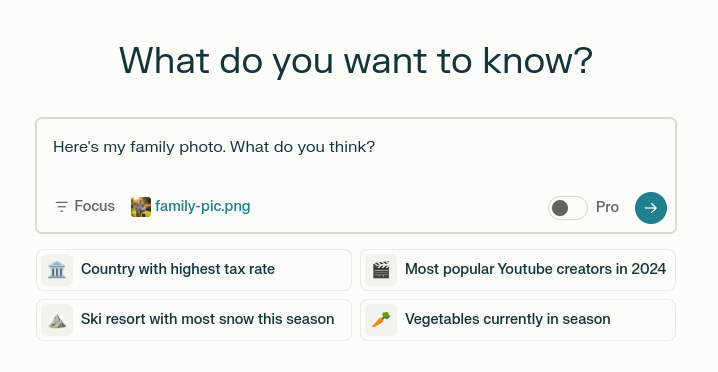
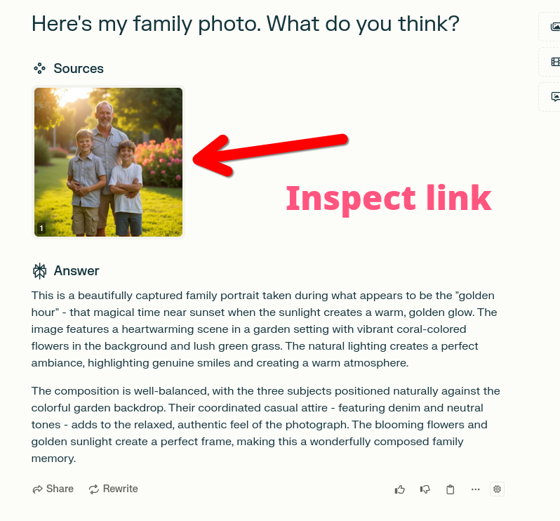
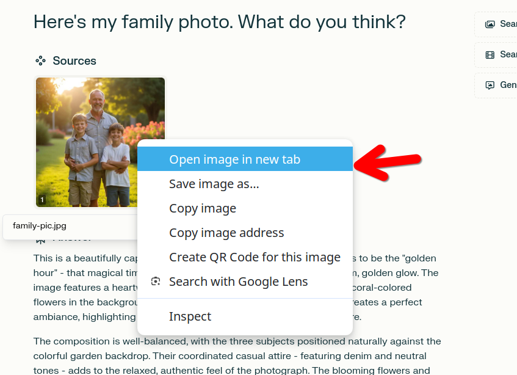
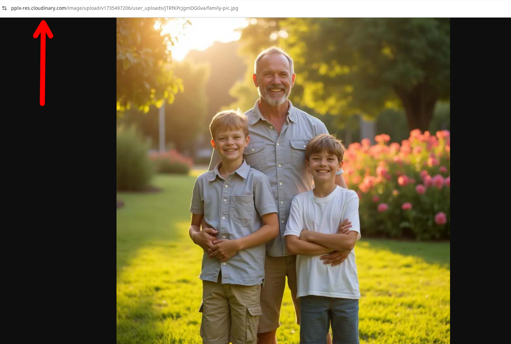
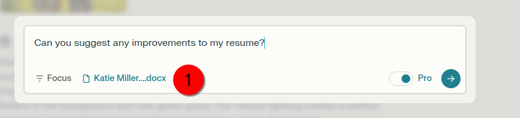
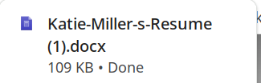
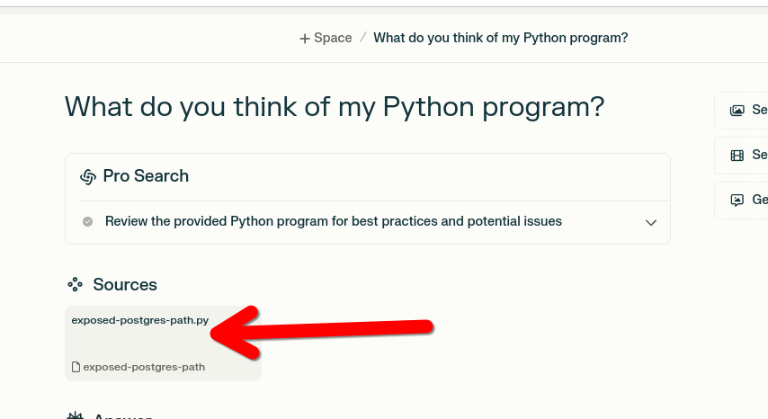
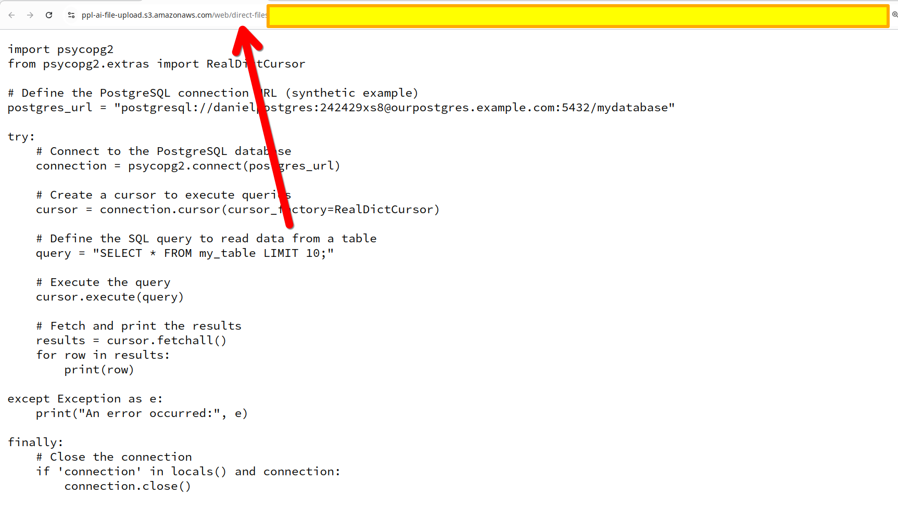
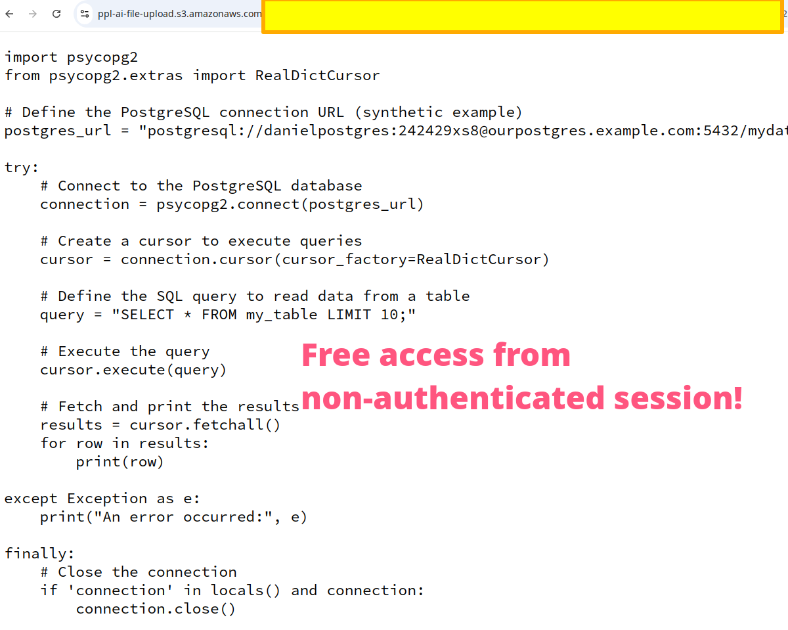

# Perplexity AI "Security Through Obscurity" December 2024

*29-Dec-24*

In December 2024, some concerned users of [Perplexity AI](https://www.perplexity.ai) began noticing that the files they were uploading to the tool and which were being added to [Cloudinary](https://www.cloudinary.com)(CDN) were accessible without authentication. 

A couple of users raised this concern with Perplexity, including myself. 

I have been subscribing to Perplexity Pro for some months, have been impressed by the software, and have widely recommended it to friends and colleagues. The purpose of this small repository is not to attempt to "shame" Perplexity, but rather, simply, to document the security posture as it existed on the date of this writing, December 29th, 2024.  

By enforcing no other security methods on their Cloudinary bucket store (at the time of writing), Perplexity is essentially subjecting its users, without their consent, to a form of security called "Security Through Obscurity."

## Method Used

A test account was created using Perplexity AI and various types of mock PII data were uploaded by adding them (using drag and drop) to prompts.

## User Uploaded Images

An image from the synthetic data store was added to a prompt:

 

The completion included the photo:

The URL was accessed:

 The URL indicates that the photo had been uploaded to a Cloudinary CDN bucket:

 The full URL:

 `https://pplx-res.cloudinary.com/image/upload/v1735497206/user_uploads/jTRfKPcJgmDGGva/family-pic.jpg`

 To verify that the resource could be accessed without authentication, the URL was pasted into a browser in a new session that was not logged into Perplexity. 

No authentication requirement prevented the resource from being accessed. 

---

## User-Uploaded Documents

A document containing personally identifiable information, including an address and a phone number, was uploaded with a prompt asking for feedback on a resume:

The URL path showed that the asset was stored in an S3 bucket.

It contained the following structure:

`https://ppl-ai-file-upload.s3.amazonaws.com/web/direct-files/{user_id}/{file_id}/{file_name}?AWSAccessKeyId={access_key}&Signature={signature}&x-amz-security-token={security_token}&Expires={expiration_timestamp}`

The file could also be downloaded form a non-authenticated browser session:

## User-Uploaded Code With Secrets

To reset handling for codes that was provided by the user, a Python program containing a hard coded secret in this repository was uploaded alongside a prompt. :

The file structure indicated that the code had also been uploaded to an AWS bucket:

 These structure was as follows:

 `https://<bucket-name>.s3.amazonaws.com/<folder-path>/<unique-id>/<file-name>?AWSAccessKeyId=<access-key-id>&Signature=<signature>&x-amz-security-token=<security-token>&Expires=<expiration-timestamp>`

 As previously the script was accessible from an unauthenticated session:

 --

 ## A Request From A Privacy-Concerned User

 Paying customers deserve better than to have the security of the personal data they commit to Perplexity AI reduced to a game of probabilities.

 It is extremely reasonable to assume that in the course of ordinary prompting, users of LLM services may commit files containing highly personal information through the mechanism of uploading data to prompts. 

 A job seeker might upload their resume containing their home address and phone number. A personal user might upload a medical file. While many might regard these practices as ill-advised. It's nevertheless reasonable to assume they are occurring. 

 It is suggested, therefore, that at the time of writing, it's probable to assume that a huge amount of user submitted data is unprotected on Cloudinary buckets. The fact that this remains the case in spite of repeated requests by users to improve security is disappointing. 

 "Security through obscurity" has failed in the past and better methods can be employed to protect user data. 

## Author

Daniel Rosehill  
(public at danielrosehill dot com)

## Licensing

This repository is licensed under CC-BY-4.0 (Attribution 4.0 International) 
[License](https://creativecommons.org/licenses/by/4.0/)

### Summary of the License
The Creative Commons Attribution 4.0 International (CC BY 4.0) license allows others to:
- **Share**: Copy and redistribute the material in any medium or format.
- **Adapt**: Remix, transform, and build upon the material for any purpose, even commercially.

The licensor cannot revoke these freedoms as long as you follow the license terms.

#### License Terms
- **Attribution**: You must give appropriate credit, provide a link to the license, and indicate if changes were made. You may do so in any reasonable manner, but not in any way that suggests the licensor endorses you or your use.
- **No additional restrictions**: You may not apply legal terms or technological measures that legally restrict others from doing anything the license permits.

For the full legal code, please visit the [Creative Commons website](https://creativecommons.org/licenses/by/4.0/legalcode).
